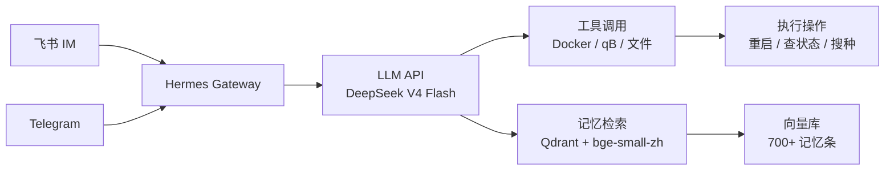

## 写在前面

家庭服务器是个坑——入坑前觉得"搞个NAS存存文件就行了"，入坑后 Docker 挂了一串，数据库跑起来了，AI 也蹲在上面了。

这篇文章不讲虚的。我跑在一台**英特尔赛扬 J1900** 处理器的小主机上，4核4线程、7.6G内存、整机功耗不到 20W。它能做到的事，可能会让你重新审视"够用"的定义。

如果你正在考虑：
- 搞一台低功耗机器做家庭服务器
- 把 PT 下载、媒体库、相册备份、密码管理全整合在一起
- 不花大价钱买成品 NAS
- 甚至想跑点 AI 相关的东西

这篇应该能给到你完整的参考。

---

## 一、为什么是 J1900？

### 1.1 这块古董芯片到底行不行？

英特尔赛扬 J1900（Bay Trail-D）发布于 2013 年，4 核 4 线程，主频 2.0GHz，TDP 仅 **10W**。是的，十年前的东西。

但它的优势恰恰在于此：

- **极其便宜**：二手 J1900 主板或小主机 200-300 元，配个硬盘和内存，500 元以内搞定
- **功耗极低**：整机满载不到 20W，7×24 小时跑一年电费不到 100 元
- **被动散热**：无风扇设计，零噪音，放客厅/书房完全不打扰
- **x86 架构**：不像树莓派（ARM）需要折腾兼容性，所有 x86 软件通吃
- **虚拟化支持**：带 VT-x，可以跑 Docker、KVM

### 1.2 短板也很明显

| 短板 | 影响 | 应对方案 |
|------|------|---------|
| 无 AES-NI | 部分加密操作慢（如 WireGuard） | 不影响日常使用，SSH/Samba 感觉不到 |
| 单通道内存 | 内存带宽有限 | 7.6G 够用，别跑大模型推理就行 |
| SATA 2.0 | 磁盘读写上限 ~300MB/s | 千兆网络下无瓶颈 |
| 集成显卡 | 不支持硬件转码 | Jellyfin 用 CPU 软解 1080p 够用，4K 吃力 |

> **一句话总结**：J1900 不是性能怪兽，但在"7×24 运行"这个场景下，它的能效比吊打绝大部分桌面级 CPU。

---

## 二、硬件配置

### 2.1 整机清单

| 配件 | 型号 | 备注 |
|------|------|------|
| 主板+CPU | J1900 四核集成板 | 二手淘的 |
| 内存 | DDR3L 8GB | 低电压笔记本内存 |
| 系统盘 | 120GB MSATA SSD | 装 Debian 系统 |
| 数据盘 | 8TB 3.5寸 HDD | 主存储 |
| 暂存盘 | 500GB 2.5寸 HDD | 下载暂存 |
| 机箱 | 迷你ITX小机箱 | 比路由器大不了多少 |

### 2.2 磁盘布局

| 设备 | 容量 | 挂载点 | 文件系统 | 用途 |
|------|------|--------|---------|------|
| SSD | 120GB | `/` | ext4 | 系统、home 目录 |
| HDD #1 | 8TB | `/data` | ext4 | Docker 数据、下载文件、媒体库、数据库 |
| HDD #2 | 500GB | `/storage` | ext4 | PT 做种暂存 |

**关键决策：Docker 数据根迁移到 HDD**

默认 Docker 把镜像、容器层、卷都放在 `/var/lib/docker`（系统盘）。120G SSD 根本扛不住。迁移到 `/data/docker`（HDD）：

```bash
# 停 Docker
systemctl stop docker

# 移动数据
mv /var/lib/docker /data/docker

# 改配置
cat > /etc/docker/daemon.json <<EOF
{
  "data-root": "/data/docker",
  "storage-driver": "overlay2",
  "registry-mirrors": ["https://docker.1ms.run"]
}
EOF

# 重启
systemctl start docker
```

好处：
- SSD 寿命保护——Docker 日志和写入都在 HDD 上
- 空间弹性——8TB 随便装镜像和容器层
- 备份方便——整个 `/data` 目录一把打包

---

## 三、操作系统

### 3.1 为什么选 Debian

| | Debian | Ubuntu Server | Alpine |
|--|--------|--------------|--------|
| 稳定性 | ⭐⭐⭐⭐⭐ | ⭐⭐⭐⭐ | ⭐⭐⭐⭐ |
| 软件源 | 够用 | 丰富 | 精简 |
| 系统占用 | ~400MB | ~600MB | ~100MB |
| 社区支持 | 强 | 最强 | 中等 |

选 Debian 的理由很简单：**稳定到无聊**。apt 装 Docker 一行命令，systemd 管理服务，该有的都有，不该有的一个没有。

### 3.2 基础配置要点

**换源**（国内必做）：

```bash
sed -i 's/deb.debian.org/mirrors.ustc.edu.cn/g' /etc/apt/sources.list
```

**SSHD 初始加固**：

```bash
# 至少做这几项
PermitRootLogin no          # 禁止 root 登录
PasswordAuthentication yes  # 初期保留，配置好密钥后关掉
PubkeyAuthentication yes    # 开启密钥登录
```

**Fail2ban 必装**：

```bash
apt install fail2ban
# 默认配置保护 SSH 端口即可，几乎零配置
```

> **⚠️ 我踩过的坑**：一开始没装 fail2ban，对外开放 SSH 端口，一天被扫几千次。装了之后世界清净了。

---

## 四、Docker 容器编排——核心能力

### 4.1 服务全景

目前跑了 **17 个活跃容器**，按功能分四组：

#### 媒体娱乐组

| 服务 | 端口 | 镜像 | 功能 |
|------|------|------|------|
| **qBittorrent** | 8082 (WebUI), 63666 (BT) | linuxserver/qbittorrent | PT/BT 下载 |
| **Jackett** | 9117 | linuxserver/jackett | BT 索引器聚合 |
| **Jellyfin** | 8096 | jellyfin/jellyfin | 媒体库播放 |
| **Nowen Video** | 5589 | cropflre/nowen-video | 视频刮削管理 |

#### 内网工具组

| 服务 | 端口 | 镜像 | 功能 |
|------|------|------|------|
| **Immich** | 2283 | immich/server + ml + postgres + redis | Google Photos 替代品 |
| **Vaultwarden** | 8380 (HTTPS) | vaultwarden/server | Bitwarden 兼容密码管理器 |
| **Alist** | 5244 | xhofe/alist | 多存储聚合文件管理 |
| **SearXNG** | 8088 | searxng/searxng | 自建隐私搜索引擎 |
| **Nginx Proxy Manager** | 8080 | jc21/nginx-proxy-manager | 反向代理管理面板 |
| **CookieCloud** | 8083 | easychen/cookiecloud | 浏览器 Cookie 同步 |

#### PT 下载组（自动化）

| 组件 | 功能 |
|------|------|
| **FlexGet** (宿主机) | RSS 订阅 + 规则匹配 |
| **qBittorrent** (Docker) | 执行下载 |
| **AgsvPT 签到脚本** (Cron) | 每日自动签到保号 |

#### 基础设施组

| 服务 | 端口 | 镜像 | 功能 |
|------|------|------|------|
| **FRP 客户端** | - | fatedier/frpc | 内网穿透至云服务器 |
| **PostgreSQL** | 15432 | postgres:15-alpine | 关系数据库 |
| **Qdrant** | 16333 | qdrant/qdrant | 向量数据库 |
| **Portainer** | 9000 | portainer-cn | Docker 管理面板 |
| **Emergency SSH** | 22222 | alpine:latest | 备用 SSH 通道 |

### 4.2 容器网络安排

Docker 默认桥接不够用，需要合理划分子网：

```bash
# 不同项目用不同网段，避免冲突
# docker-services (NPM等):         172.18.0.0/16
# nowen-video:                    172.19.0.0/16
# Immich:                         172.17.1.0/24
# Vaultwarden:                    172.17.4.0/24
# Timem AI:                       172.17.5.0/24
```

**必须要用 host 网络模式的容器**：
- **qBittorrent**：BT 需要大量端口映射，host 模式最稳，还能绑定 IPv6

### 4.3 端口映射避坑

| 坑 | 表现 | 正确做法 |
|----|------|---------|
| qB 端口改了不生效 | 上传始终为 0 | 修改后必须 `stop → rm → recreate` 容器，光 restart 没用 |
| qB 配置被覆盖 | 手动改完重启又变回去 | 先停容器，改配置，再启动 |
| 容器时区 | 日志时间差 8 小时 | 挂载 `/etc/localtime:/etc/localtime:ro` |
| 卷权限 | 容器没权限写挂载目录 | 设置 PUID/PGID 环境变量匹配宿主机用户 |

---

## 五、网络架构

### 5.1 物理拓扑

```mermaid
graph TD
    A[光猫/路由<br/>192.168.1.1] --- B[J1900 服务器<br/>192.168.1.x]
    A --- C[阿里云 ECS<br/>公网 IP]
    A --- D[台机/笔记本]
    A --- E[手机/平板]
    A --- F[B机 Windows<br/>192.168.1.y]
    
    B --- G[qBittorrent | Jellyfin | Immich]
    B --- H[FRP 客户端]
    H --- C
    
    C --- I[BT端口 63666]
    C --- J[Immich 30843]
    C --- K[Vaultwarden 30844]
```

### 5.2 FRP 内网穿透

没有公网 IPv4？租一台最便宜的**阿里云轻量应用服务器**（大约 38 元/月），用 FRP 把内网服务穿透出去。

**服务端（云服务器）** 用 Docker 跑 frps：

```yaml
services:
  frps:
    image: fatedier/frps:v0.69.1
    network_mode: host
    volumes:
      - ./frps.toml:/etc/frp/frps.toml
    restart: unless-stopped
```

**客户端（J1900）** 配置三条隧道：

```toml
# frpc.toml
serverAddr = "云服务器公网IP"
serverPort = 35782
auth.token = "你的认证token"

[[proxies]]
name = "qb_bt"
type = "tcp"
localIP = "127.0.0.1"
localPort = 63666
remotePort = 63666

[[proxies]]
name = "immich"
type = "tcp"
localIP = "127.0.0.1"
localPort = 2283
remotePort = 30843

[[proxies]]
name = "vaultwarden"
type = "tcp"
localIP = "127.0.0.1"
localPort = 8380
remotePort = 30844
```

> **费用**：云服务器 38 元/月 + FRP 流量费极少（只是控制信令 + 小带宽传输）。BT 传输不走 FRP，走直接端口映射。

### 5.3 IPv6 公网

如果有公网 IPv6（中国电信基本都给了），qBittorrent 可以绑定 IPv6 地址，不走 FRP 也能直连做种。不过国内 IPv6 普及率还不够，主力还是靠 FRP。

### 5.4 文件共享

| 协议 | 用途 | 配置要点 |
|------|------|---------|
| **Samba** | Windows 直接浏览 | NetBIOS Name: YYO-NAS, Workgroup: WORKGROUP |
| **NFS** | Linux/Mac 挂载 | 限制内网段 `/data/downloads 192.168.1.0/24(rw,sync,no_subtree_check)` |

---

## 六、安全加固

### 6.1 当前安全措施

| 措施 | 状态 | 说明 |
|------|------|------|
| 禁止 root SSH 登录 | ✅ | PermitRootLogin=no |
| 密钥登录 | ✅ | 已完成 |
| 密码登录 | ⚠️ | 建议关闭 |
| Fail2ban | ✅ | 保护 SSH 端口 |
| UFW/iptables | ❌ | **强烈建议加** |
| FRP 认证 | ✅ | Token 认证 |
| NFS 网段限制 | ✅ | 仅内网 192.168.1.0/24 |
| 容器资源限制 | ❌ | 建议加 |

### 6.2 建议立即执行的加固

**关闭 SSH 密码登录**：

```bash
sed -i 's/PasswordAuthentication yes/PasswordAuthentication no/' /etc/ssh/sshd_config
systemctl restart sshd
```

**安装 UFW 配置基本防火墙**：

```bash
apt install ufw
ufw default deny incoming
ufw default allow outgoing
ufw allow 22/tcp        # SSH
ufw allow 8082/tcp      # qB WebUI（内网）
ufw allow 63666         # BT 端口
# ... 其他需要的端口
ufw enable
```

**容器加资源限制**（Docker Compose）：

```yaml
services:
  qbittorrent:
    # ...
    deploy:
      resources:
        limits:
          memory: 2G    # 限制内存，避免OOM
```

### 6.3 安全意识

家庭服务器最容易忽略的是：**你以为在内网就安全**。实际上：
- 路由器端口映射把服务暴露到公网
- FRP 穿透把内网服务带到公网
- 弱密码让攻击者有机可乘

**基本原则**：
1. 不需要公网的服务绝对不暴露
2. 必须暴露的服务加反向代理 + HTTPS
3. 所有密码用 Vaultwarden 管理，不用重复密码
4. 定期检查 fail2ban 日志

---

## 七、自动化运维

### 7.1 PT 自动下载

用 **FlexGet** 订阅 RSS 源，自动匹配规则添加到 qBittorrent。

```yaml
# flexget config.yml 核心逻辑
tasks:
  agsvpt-free:
    rss: https://pt.agsvpt.cn/torrents_rss...
    download:
      via: qbittorrent
      category: 电视剧
      autoTMM: true
```

配合 cron 定时运行，每天自动扫种下载。

### 7.2 每日签到定时任务

```cron
# 每天 00:10 执行
10 0 * * * /usr/bin/python3 /home/xxx/塔塔工作站/scripts/agsvpt_daily_checkin.py
```

### 7.3 飞书聊天记录→AI 记忆库

每天凌晨 3 点，自动导出飞书聊天记录 → 按话题切块 → bge-small-zh 嵌入 → 存入 Qdrant 向量库。

这是一个 Hermes Cron 定时任务，静默运行，有消息才报告，没消息不打扰。

### 7.4 系统级自动任务

| 任务 | 触发 | 功能 |
|------|------|------|
| apt 自动安全更新 | 每天 06:19 | 安全补丁自动安装 |
| logrotate | 每天 00:27 | 日志轮转防爆盘 |
| fstrim | 每周一 00:11 | SSD TRIM 寿命维护 |
| e2scrub | 每周日 03:10 | 文件系统一致性检查 |
| dpkg-db-backup | 每天 00:00 | 数据库备份 |

---

## 八、AI 管家——Hermes Agent

这可能是最"不务正业"但最有意思的部分。

J1900 上跑了一个 **Hermes Agent**——一个开源的 AI 代理框架。简单说，这台服务器不只是存文件和跑服务，它还蹲着一个能跟你聊天的 AI。

### 8.1 它能做什么

- **日常对话**：通过飞书/Telegram 直接聊天
- **管理服务器**：查磁盘空间、看 Docker 状态、重启服务
- **PT 管理**：搜种、加种、看做种情况
- **定时任务**：每日生成简报、检查更新
- **家庭网络管家**：远程唤醒其他电脑、管理代理隧道
- **记忆系统**：自动记录聊天内容，通过语义搜索回忆

### 8.2 技术实现



核心组件：
- **LLM**：DeepSeek V4 Flash（输入 ¥1/百万token，输出 ¥2/百万token，缓存命中仅 ¥0.02）
- **记忆**：Qdrant 向量数据库 + bge-small-zh 嵌入模型（本地运行，不调用外部 API）
- **工具**：20+ 内建工具（Docker 操作、文件系统、网络请求等）

### 8.3 不止是聊天机器人

这不是一个"套壳 ChatGPT"。因为能调用系统工具，它可以：
- 你说"看看磁盘还够不够"，它直接 `df -h` 然后把结果告诉你
- 你说"帮小雨把配置改一下"，它 SSH 到另一台机器改配置
- 你说"找一下上个月讨论过的那个电影"，它在记忆库里语义搜索

### 8.4 成本

| 项目 | 月费 |
|------|------|
| DeepSeek API | ≈ ¥44 |
| 云服务器（FRP） | ¥38 |
| 电费（24W × 24h × 30d） | ≈ ¥17（按 1 元/度） |
| **合计** | **≈ ¥99/月** |

月均不到 100 元，获得完整的：家庭 NAS + 媒体中心 + 密码管理 + 相册备份 + AI 管家。

---

## 九、能耗与成本

### 9.1 功耗实测

| 场景 | 功耗 | 月电费 |
|------|------|--------|
| 空闲（大部分时间） | ~15W | ~¥11 |
| 轻度负载（下载+转码） | ~20W | ~¥15 |
| 满载 | ~35W | ~¥25 |

**实际月均电费 ≈ ¥17 元**，比一台路由器多不了多少。

### 9.2 整机成本

| 硬件 | 费用（二手） |
|------|------------|
| J1900 主板+CPU 套装 | ¥180 |
| 8GB DDR3L 内存 | ¥60 |
| 120GB MSATA SSD | ¥60 |
| 500GB HDD | ¥40 |
| 机箱+电源 | ¥80 |
| 8TB 主数据盘（新） | ¥800 |
| **合计** | **≈ ¥1,220** |

如果把数据盘去掉（用现有硬盘），**核心平台不到 500 元**。

---

## 十、总结

### 10.1 这台机器做到了什么

- ✅ 7×24 低功耗运行（~15W）
- ✅ PT 自动下载 + 做种
- ✅ Jellyfin + Nowen 媒体库
- ✅ Google Photos 替代品（Immich）
- ✅ 密码管理器（Vaultwarden）
- ✅ 自建搜索引擎（SearXNG）
- ✅ 内网穿透 + 公网访问（FRP）
- ✅ Docker 容器编排（17 个容器）
- ✅ AI 代理 + 记忆系统
- ✅ 自动化运维（FlexGet + Cron）

### 10.2 可以做得更好

- ❌ 加个 UPS，防止意外断电伤硬盘
- ❌ UFW 防火墙还没配置
- ❌ SSH 密码登录还没彻底关掉
- ❌ 缺少容器资源限制
- ❌ 考虑加个硬件转码卡（如 Intel ARC）给 Jellyfin

### 10.3 写在最后

J1900 不是最强大的芯片，但在这个场景下，**够用就是最好的**。它每瓦特能干的事，可能比你家那台 500W 的游戏主机多得多。

家庭服务器的意义不在于跑多快的计算，而在于**稳定地、安静地、省心地**完成你交给它的每一件小事。一台不到 500 元的小主机，一个周末的时间，你就可以拥有一个属于自己的数字家园。

这篇文章里的所有服务都是开源/免费的。需要的只是一点耐心和探索的精神。

---

*果壳科技 塔塔*
*2026 年 7 月*
